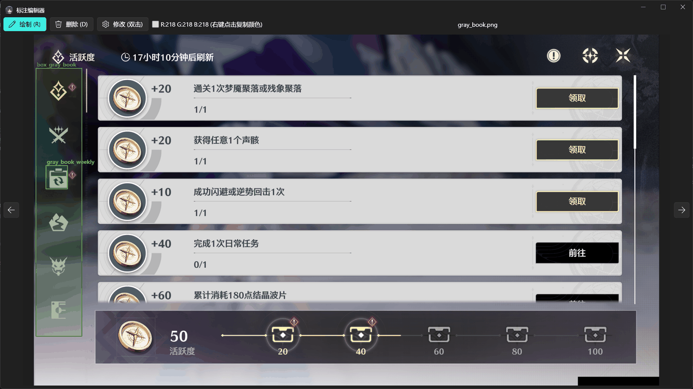

# ok-script-app

[English](en/index.md)

ok-script-app 是一个基于 [ok-script](https://github.com/ok-oldking/ok-script) 的 Python 自动化项目模板，适用于 Windows 原生游戏、Android 模拟器和浏览器游戏。

这个仓库不是某个具体游戏的自动化成品。它提供可直接运行的 GUI、任务与配置控件示例、OCR、模板匹配、测试、i18n、EXE 打包和更新发布配置。

## 从这里开始

1. 按照[快速开始](getting-started.md)从模板创建并初始化仓库。
2. 在[应用配置](configuration.md)中选择至少一种运行目标。
3. 根据[任务开发](tasks.md)创建并注册第一个任务。
4. 使用[打包与发布](release.md)中的流程生成 EXE。

## 功能演示

### API 列表与脚本录制

### 多种截图与交互方式

### 标注管理与模板匹配

## 主要内容

- `MyOneTimeTask` 和 `MyTriggerTask` 任务示例。
- 下拉框、布尔值、数值、文本、列表、多选、文件选择、全局配置和按钮组等配置控件。
- OCR、相对区域识别和模板匹配示例。
- `ConfigOption` 全局配置和 `TaskTestCase` 自动化测试示例。
- gettext i18n 翻译文件和编译产物。
- PyAppify 和 GitHub Actions 打包发布配置。

## 继续阅读

- [游戏自动化入门](https://github.com/ok-oldking/ok-script/blob/master/docs/intro_to_automation/README.md)
- [ok-script 快速开始](https://github.com/ok-oldking/ok-script/blob/master/docs/quick_start/README.md)
- [进阶使用](https://github.com/ok-oldking/ok-script/blob/master/docs/after_quick_start/README.md)
- [API 文档](https://github.com/ok-oldking/ok-script/blob/master/docs/api_doc/README.md)
